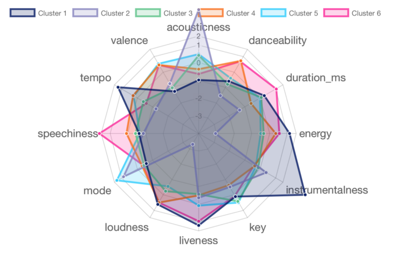

# ONGOING - Spotify-Persona-Clustering


This project uses the Spotify API to retrieve audio features for a given list of tracks. The most relevant section for the Supervised/Unsupervised Learning performed can be found [here](https://developer.spotify.com/documentation/web-api/reference/#/operations/get-several-audio-features)



## Spotify API

The Spotify API is a powerful tool that allows developers to access a vast collection of music data, including audio features, artist information, and track metadata. To use the Spotify API in your project, you will need to register your application with Spotify and obtain an access token. You can find detailed documentation and examples on the [Spotify Developer Website](https://developer.spotify.com/documentation/web-api/).

### Authentication

To authenticate your requests to the Spotify API, you will need to include an access token in your requests. You can obtain an access token by following the [Authorization Code Flow](https://developer.spotify.com/documentation/general/guides/authorization-guide/#authorization-code-flow) or the [Implicit Grant Flow](https://developer.spotify.com/documentation/general/guides/authorization-guide/#implicit-grant-flow) depending on your use case.

### Endpoints

The Spotify API provides a wide range of endpoints that allow you to retrieve and manipulate music data. Some of the most commonly used endpoints include:

- `GET /v1/tracks/{id}` - Retrieve a track by its Spotify ID
- `GET /v1/audio-features/{id}` - Retrieve audio features for a track by its Spotify ID
- `GET /v1/playlists/{playlist_id}/tracks` - Retrieve the tracks in a playlist by its Spotify ID

You can find the full list of endpoints and their documentation on the [Spotify Developer Website](https://developer.spotify.com/documentation/web-api/reference/).

This project is in its beginning stages. For an overview, click [here](https://purrfect-zinc-f80.notion.site/Spotify-57e38776f1fc4f30a1381f45c42b1d36)

Structure
```
Spotify Persona Clustering
├── code
│   ├── data
│   │    ├── README.md
│   │    ├── songs.csv
│   │    │ 
│   │    └── features.csv
│   │    
│   └── src
│        ├── README.md
│        ├── environment.yml
│        ├── preprocess
│        │        ├── scrape_spotify.py
│        │        └── preprocess.ipynb
│        │     
│        ├── supervised
│        │        └── knn.ipynb
│        └── unsupervised
│                 └── kmeans.ipynb
├── LICENSE
├── requirements.txt
└── README.md
```

# Usage

Please make sure all requirements and dependencies are installed in order for proper usage.

## Install
clone the repository
```
git clone https://github.com/natdosan/Spotify-Persona-Clustering
```
Go the repository directory, switch the branch if running branch other than master
```
cd Spotify-Persona-Clustering
git checkout <branch you'd like to run>
```
Create conda environment and activate it
```
cd front-end-vis
conda env create -f environment.MacOS.Linux.yml
conda activate Spotify
```
